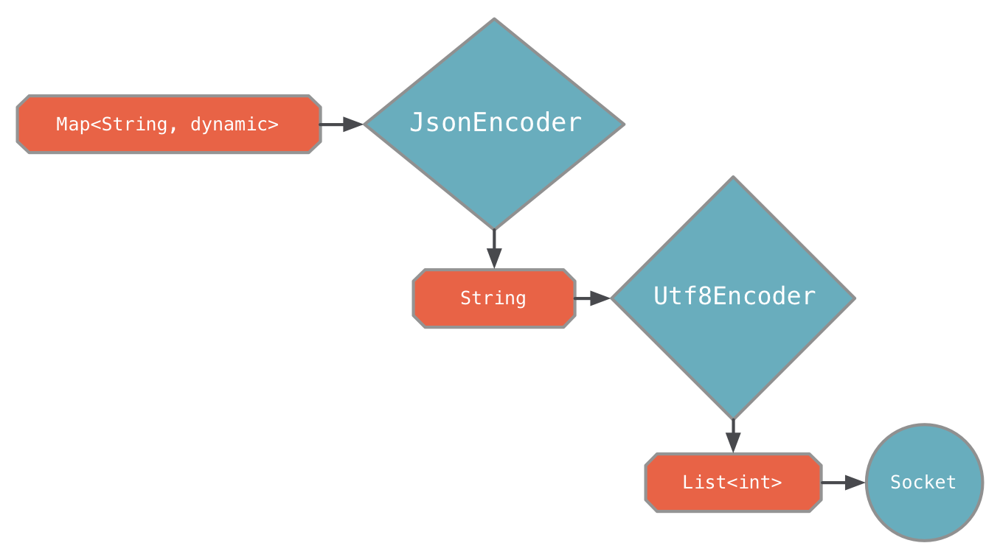
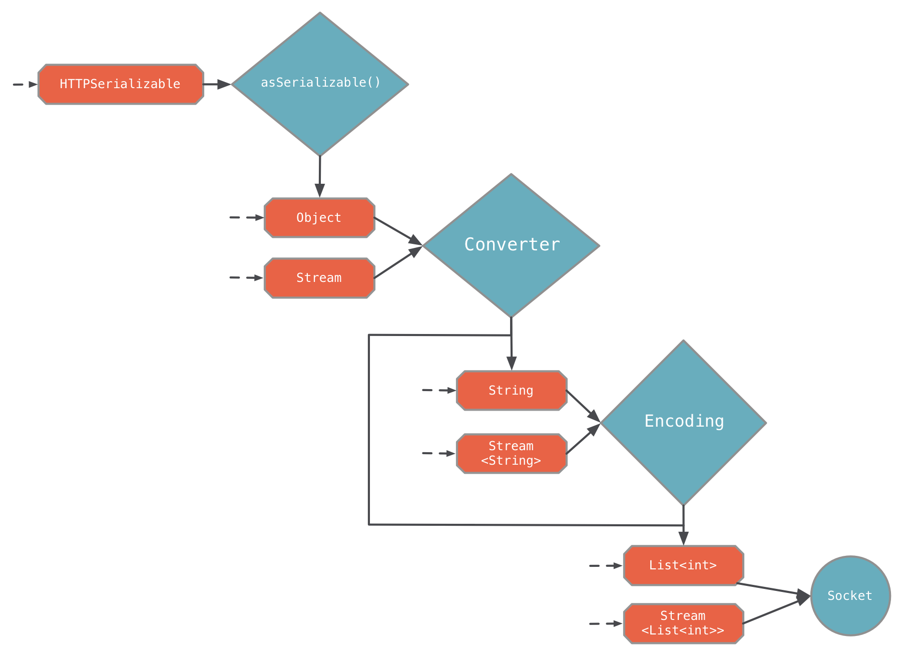

# Request and Response Objects

In Aqueduct, HTTP requests and responses are instances of `Request` and `Response`, respectively. For every HTTP request an application receives, an instance of `Request` is created. A `Response` must be created for each `Request`. Requests pass through a channel of [RequestControllers](request_controller.md) to be validated, modified and finally responded to.

## The Request Object

An instance of `Request` represents an HTTP request. They are automatically created when the application receives a request and are delivered to your application's `RequestSink`. A `Request` is a wrapper around the Dart standard library `HttpRequest` and its values - such as headers - can be accessed through its `innerRequest`. (Just don't write to its `response` - Aqueduct does that.)

A `Request` has a `body` property. This property decodes the HTTP request body into Dart objects based on the request's content type. The mechanism to decode the body is determined by `HTTPCodecRepository`, which is covered in more detail in a later section. By default, decoders exist for text, JSON and form data.

A `Request` may go through many `RequestController`s before it is finally responded to. These `RequestController`s may validate or add more information to the request as it passes through. For example, an `Authorizer` - a subclass of `RequestController` - will validate the Authorization header of a request. Once validated, it will add authorization info to the request - like the user for an OAuth 2.0 bearer token - and pass it to the next `RequestController`. The next controller in the channel has access to the authorization info without having to fetch the information again.

These additional values are added to a `Request`'s `attachments` property. A `Request` also has two built-in attachments, `authorization` and `path`. `authorization` contains authorization information created by an `Authorizer` and `path` has request path information created by a `Router`.

`Request`s are responded to by returning an instance of `Response` from a `RequestController` (see [RequestControllers](request_controller.md)).

## Response Objects and HTTP Body Encoding

An instance of `Response` has a status code, HTTP headers and an HTTP body. There are a number of convenience constructors for `Response` for commonly used status codes. For example, `Response.ok` creates a 200 OK status code response.

```dart
var response = new Response.ok({"key": "value"});
```

When a `Response` is returned from a request controller, Aqueduct handles sending the HTTP response back to the client.

An HTTP response often contains a *body*. For example, the body in response to `GET /users/1` might be JSON object that represents a user. To ensure the client understands that the body is a JSON object, it includes the header `Content-Type: application/json; charset=utf-8`.

When creating a `Response` that has a body, you provide a *body object* and a `contentType`. The body object is passed to one of `Response`'s constructors. For example, this map` is the body object of a response:

```dart
var map = {"key": "value"};

// ContentType.JSON is the default, setting it may be omitted.
// ContentType.JSON == `application/json; charset=utf-8'
var response = new Response.ok(map)
  ..contentType = ContentType.JSON;
```

Body objects are encoded according to their content-type. In the above, `map` is first encoded as a JSON string and then to a list of UTF8 bytes.



A `ContentType` is made up of three components: a primary type, a subtype and an optional character set.


The primary and subtype determine the first conversion step and the charset determines the next. Each step is performed by an instance of `Codec`. For example, the content type `application/json` selects `JsonCodec`, while charset `utf-8` selects `Utf8Codec`. These two codecs are run in succession to convert the `Map` to a list of bytes.

The body object must be a valid input for the initial encoder step. In the above example, a `Map<String, dynamic>` can be encoded by a `JsonCodec`. But if the body object was something silly - like an `Isolate` - encoding would fail at runtime and the client would be sent a 500 Server Error response. A valid input for one `Codec` may not be valid for another; it is up to you to ensure that the body object is valid for the `contentType` of the response.

Not all content types require two conversion steps. For example, when serving an HTML file, the body object is already an HTML `String`. It will only be converted by a charset encoder:

```dart
var html = "<html></html>";
var response = new Response.ok(html)
  ..contentType = ContentType.HTML;
```

And an image body object needs no conversion at all, since it is already a list of bytes:

```dart
var imageFile = new File("image.jpg");
var imageBytes = await imageFile.readAsBytes();
var response = new Response.ok(imageBytes)
  ..contentType = new ContentType("image", "jpeg");
```

See a later section for more details on content type to codec mappings. Also, see the documentation for `HTTPCodecRepository` for details on built-in codecs and adding codecs.

### Streaming Response Bodies

A body object may also be a `Stream<T>`. `Stream<T>` body objects are most often used when serving files. This allows the contents of the file to be streamed from disk to the HTTP client without having to load the whole file into memory first. (See also `HTTPFileController`.)

```dart
var imageFile = new File("image.jpg");
var imageByteStream = imageFile.openRead();
var response = new Response.ok(imageByteStream)
  ..contentType = new ContentType("image", "jpeg");
```

When a body object is a `Stream<T>`, the response will not be sent until the stream is closed. For finite streams - like those from opened filed - this happens as soon as the entire file is read. For streams that you construct yourself, you must close the stream some time after the response has been returned.

### Custom Objects

Any object may be the body object of a `Response` if it implements `HTTPSerializable`. An object conforming to this type must implement `asMap()`, which gets invoked on the body object prior to it being sent to the first encoding step. For example, the following object can be used as a body object and is automatically converted into a `Map` and then JSON encoded:

```dart
class Person implements HTTPSerializable {
  String name;
  String email;

  Map<String, dynamic> asMap() {
    return {
      "name": name,
      "email": email
    };
  }

  ...
}

var person = new Person();
var response = new Response.ok(person);
```

`ManagedObject<T>`, part of the Aqueduct ORM, implements `HTTPSerializable` so results from `Query<T>` may be body objects:

```dart
var query = new Query<Person>()..where.id = whereEqualTo(1);
var person = await query.fetchOne();
var response = new Response.ok(person);

// or List<Serializable>

var query = new Query<Person>();
var people = await query.fetch();
var response = new Response.ok(people);
```

Note that a `Map` itself is not `HTTPSerializable` and can't have `HTTPSerializable` values. For example, the following wouldn't work:

```dart
var map = {
  "person": new Person()
};
var response = new Response.ok(map);
```

The entire flow of a body object is shown in the following diagram. Each orange item is an allowed body object type and shows the steps it will go through when being encoded to the HTTP response body. For example, a `HTTPSerializable` goes through three steps, whereas a `List<int>` goes through zero steps and is added as-is to the HTTP response.



### Codecs and Content Types

In the above sections, we glossed over how a codec gets selected when preparing the response body. The common case of `ManagedObject<T>` body objects that are sent as UTF8 encoded JSON 'just works' and is suitable for most applications. When serving assets for a web application or different data formats like XML, it becomes important to understand how Aqueduct's codec repository works.

`HTTPCodecRepository` contains mappings from content types to `Codec`s. These codecs encode response bodies and decode request bodies. There are three built-in codecs for `application/json`, `application/x-www-form-urlencoded` and `text/*`. When a response is being sent, the repository is searched for an entry that exactly matches the primary and subtype of the `Response.contentType`. If an entry exists, the associated `Codec` starts the conversion. For example, if the content type is `application/json; charset=utf-8`, the built-in `application/json` codec encodes the body object. The character set is not evaluated at this stage.

If there isn't an exact match, but there is an entry for the primary type with the wildcard (`*`) subtype, that codec is used. For example, the built-in codec for `text/*` will be selected for both `text/plain` and `text/html`. If there was something special that had to be done for `text/html`, a more specific codec may be added for that type:

```dart
class MySink extends RequestSink {
  MySink(ApplicationConfiguration config) : super(config) {
    HTTPCodecRepository.defaultInstance.add(new ContentType("application", "html"), new HTMLCodec());
  }
}
```

Content type to codec mappings are added in the constructor of an application's [RequestSink](request_sink.md). The codec must implement `Codec` from `dart:convert`. In the above example, when a response's content type is `text/html`, the `HTMLCodec` will encode the body object. This codec takes precedence over `text/*` because it is more specific.

When selecting a codec for a response body, the `ContentType.charset` doesn't impact which codec is selected. For example, the following two lines are equivalent:

```dart
HTTPCodecRepository.defaultInstance.add(new ContentType("application", "html"), new HTMLCodec());
HTTPCodecRepository.defaultInstance.add(new ContentType("application", "html", charset: "utf-8"), new HTMLCodec());
```

If a response's content-type has a charset, then a charset encoder like `UTF8` will be applied as a last encoding step. For example, a response with content-type `application/json; charset=utf-8` will encode the body object as a JSON string, which is then encoded as a list of UTF8 bytes. It is required that a response body's eventually encoded type is a list of bytes, so it follows that a codec that produces a string must have a charset.

If there is no codec in the repository for the content type of a `Response`, the body object must be a `List<int>` or `Stream<List<int>>`. If you find yourself converting data prior to setting it as a body object, it may make sense to add your own codec to `HTTPCodecRepository`.

A request's body, on the other hand, always starts as a list of bytes. To decode a JSON request body, it first must be decoded from the list of UTF8 bytes into a string. It is possible that a client could omit the charset in its content-type header. Codecs added to `HTTPCodecRepository` may specify a default charset to interpret a charset-less content-type. When a codec is added to the repository, if content-type's charset is non-null, that is the default. For example, the JSON codec is added like this:

```dart
HTTPCodecRepository.defaultInstance.add(
  new ContentType("application", "json", charset: "utf-8"),
  const JsonCodec(),
  allowCompression: true);
```

If the charset is null, no charset decoding occurs on a request body if one doesn't exist. Content-types that are decoded from a `String` should not use a default charset because the repository would always attempt to decode the body as a string first.

### Compression with gzip

Body objects may be compressed with `gzip` if the HTTP client allows it *and* the `HTTPCodecRepository` has been configured to compress the content type of the response. The three built-in codecs - `application/json`, `application/x-www-form-urlencoded` and `text/*` - are all configured to allow compression. Compression occurs as the last step of conversion and only if the HTTP client sends the `Accept-Encoding: gzip` header.

Content types that are not in the codec repository will not trigger compression, even if the HTTP client allows compression with the `Accept-Encoding` header. This is to prevent binary contents like images from being 'compressed', since they are likely already compressed by a content-specific algorithm. In order for Aqueduct to compress a content type other than the built-in types, you may add a codec to the repository with the `allowCompression` flag. (The default value is `true`.)

```dart
MySink(ApplicationConfiguration config) : super(config) {
  HTTPCodecRepository.add(
    new ContentType("application", "x-special"),
    new MyCodec(),
    allowCompression: true);
}
```

You may also set whether or not a content type uses compression without having to specify a codec if no conversion step needs to occur:

```dart
HTTPCodecRepository.setAllowsCompression(new ContentType("application", "x-special"), true);
```
